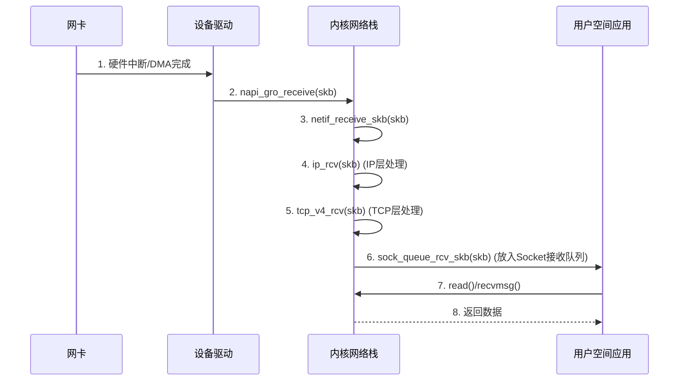
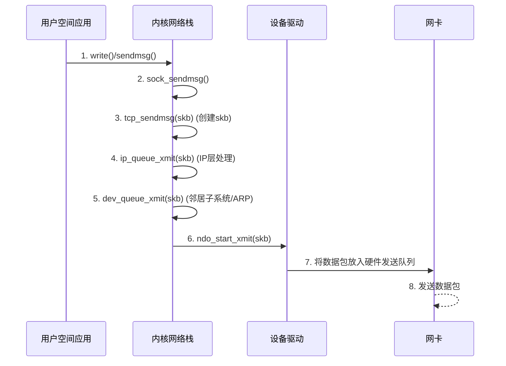
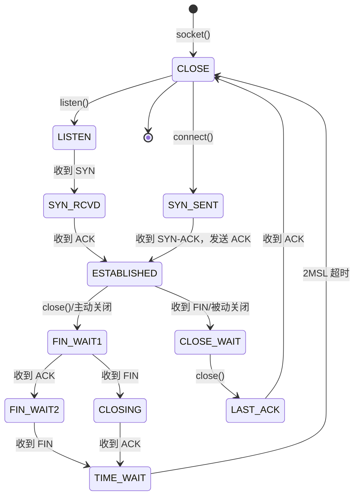

# Linux 内核网络模块分析

本文档旨在概述 Linux 内核网络模块的核心架构、数据链路、关键数据结构以及 API 调用关系。

## 1. 网络模块分层架构

Linux 网络栈是一个复杂的分层结构，严格遵循 OSI 模型，但通常在实现上简化为四层 TCP/IP 模型。

```mermaid
graph TD
    A[用户空间应用] --> B(Socket 层);
    B --> C{协议无关层 (INET Socket)};
    C --> D{协议层 (TCP, UDP, IP, ICMP)};
    D --> E{网络设备无关层 (Link Layer)};
    E --> F[网络设备驱动];
    F --> G((物理网络));

    subgraph Kernel Space
        B
        C
        D
        E
        F
    end
```

- **Socket 层**: 为用户空间应用程序提供标准的系统调用接口（如 `socket()`, `bind()`, `sendmsg()`, `recvmsg()`）。
- **协议层**: 实现具体的 L3/L4 协议，如 TCP, UDP, IP。这是网络栈的核心，处理数据包的分片、重组、校验和、拥塞控制等。
- **网络设备无关层**: 提供一个统一的接口（`net_device` 结构）来与下层的各种网络设备驱动交互。
- **网络设备驱动**: 直接与硬件通信，负责将数据包放入硬件发送队列，或从硬件接收队列中取出数据包。

## 2. 关键数据结构

### `struct sk_buff` (Socket Buffer)

`sk_buff` 是 Linux 网络栈的“血液”。几乎所有的数据包在内核中都以 `sk_buff` 的形式存在。它是一个复杂的数据结构，包含了数据包的所有信息。

- `head`, `data`, `tail`, `end`: 指针，用于管理数据包的缓冲区。`data` 指向当前协议头的开始位置。
- `len`: 数据包总长度。
- `sk`: 指向拥有此 `sk_buff` 的 `socket` 结构。
- `dev`: 指向关联的网络设备 `net_device`。
- `transport_header`, `network_header`, `mac_header`: 指向各层协议头的偏移量。

### `struct net_device`

此结构是内核中对一个网络设备（如 `eth0`）的抽象。它包含了设备的属性（如 MAC 地址、MTU）和操作函数集。

- `name`: 设备名，如 "eth0"。
- `mtu`: 最大传输单元。
- `netdev_ops`: 一个函数指针集合，指向该设备驱动实现的具体操作，如 `ndo_open` (打开设备), `ndo_stop` (关闭设备), 和最重要的 `ndo_start_xmit` (开始发送数据包)。

### Socket 通信相关数据结构

#### `struct socket` (BSD Socket 抽象)

**位置**: `include/linux/net.h:116`

`socket` 结构是内核对 BSD socket 的通用抽象层，用于表示用户空间应用程序创建的 socket。

- `state`: socket 状态 (如 `SS_CONNECTED`, `SS_DISCONNECTING` 等)
- `type`: socket 类型 (`SOCK_STREAM`, `SOCK_DGRAM`, `SOCK_RAW` 等)
- `flags`: socket 标志位 (如 `SOCK_NOSPACE`)
- `file`: 指向关联的文件描述符对象 (用于 GC 和文件系统集成)
- `sk`: 指向协议无关的 socket 表示 (`struct sock`)，是真正的网络协议 socket
- `ops`: 协议特定的操作函数集合 (`struct proto_ops`)
- `wq`: 等待队列，用于阻塞式 I/O

#### `struct proto_ops` (协议操作接口)

**位置**: `include/linux/net.h:161`

定义了协议族特定的操作函数集，例如 IPv4 TCP 和 UDP 各有自己的 `proto_ops` 实现。

关键函数指针:
- `bind()`: 绑定 socket 到本地地址
- `connect()`: 连接到远程地址 (面向连接的协议)
- `listen()`: 监听连接请求
- `accept()`: 接受连接请求，创建新的 socket
- `sendmsg()`: 发送消息
- `recvmsg()`: 接收消息
- `poll()`: 支持 select/poll/epoll 等 I/O 多路复用

#### `struct sock` (协议无关的 Socket 核心)

**位置**: `include/net/sock.h:354`

这是内核中真正的网络 socket 表示，包含了协议栈所需的所有状态信息。

关键成员:
- `__sk_common`: 共享的公共字段 (`struct sock_common`)
- `sk_receive_queue`: 接收数据队列 (`struct sk_buff_head`)
- `sk_write_queue`: 发送数据队列
- `sk_error_queue`: 错误队列 (用于 `MSG_ERRQUEUE`)
- `sk_backlog`: 积压队列，用于软中断上下文延迟处理
- `sk_rcvbuf`: 接收缓冲区大小
- `sk_sndbuf`: 发送缓冲区大小
- `sk_socket`: 指向上层 BSD socket (`struct socket`)
- `sk_prot`: 协议操作函数集 (`struct proto`)
- `sk_state`: socket 状态 (如 TCP_ESTABLISHED, TCP_LISTEN)
- `sk_lock`: socket 锁，保护并发访问
- `sk_data_ready`: 回调函数，当有数据到达时通知上层

**状态相关宏定义** (通过 `__sk_common` 访问):
- `sk_state`: 当前连接状态
- `sk_num`: 本地端口号
- `sk_dport`: 目标端口号
- `sk_daddr`: 目标 IPv4 地址
- `sk_rcv_saddr`: 本地绑定的 IPv4 地址
- `sk_family`: 地址族 (AF_INET, AF_INET6)

#### `struct sock_common` (Socket 公共字段)

**位置**: `include/net/sock.h:180`

多种 socket 类型 (如 `struct sock`, `struct inet_timewait_sock`) 共享的公共字段。

- `skc_daddr`: 目标地址
- `skc_rcv_saddr`: 接收源地址
- `skc_hash`: socket 哈希值，用于快速查找
- `skc_portpair`: 本地端口和远程端口组合 (64位)
- `skc_addrpair`: 本地地址和远程地址组合 (64位)
- `skc_state`: socket 状态
- `skc_prot`: 指向协议操作结构 (`struct proto`)
- `skc_net`: 网络命名空间
- `skc_refcnt`: 引用计数


1. 共享公共字段 (__sk_common - sock.h:359)
struct sock_common __sk_common;
包含所有套接字类型共享的字段:
地址信息:
skc_daddr / sk_daddr: 目的 IP 地址
skc_rcv_saddr / sk_rcv_saddr: 本地接收地址
skc_v6_daddr / sk_v6_daddr: IPv6 目的地址
端口信息:
skc_dport / sk_dport: 目的端口
skc_num / sk_num: 本地端口号
核心状态:
skc_state / sk_state: 套接字状态 (如 TCP_ESTABLISHED)
skc_family / sk_family: 地址族 (AF_INET/AF_INET6)
skc_refcnt / sk_refcnt: 引用计数
skc_hash / sk_hash: 哈希表查找键值
协议与网络:
skc_prot / sk_prot: 协议操作函数表指针
skc_net / sk_net: 所属网络命名空间
2. 接收路径 - 写端 (sock_write_rx - sock.h:394)
atomic_t sk_drops;                    // 丢包统计
__s32 sk_peek_off;                    // MSG_PEEK 偏移量
struct sk_buff_head sk_error_queue;   // 错误队列
struct sk_buff_head sk_receive_queue; // 接收队列
struct {                               // 积压队列
    atomic_t rmem_alloc;              // 接收缓冲区已分配内存
    int len;                          // 队列长度
    struct sk_buff *head;             // 队列头
    struct sk_buff *tail;             // 队列尾
} sk_backlog;
作用: 管理接收数据包的缓冲和排队,sk_backlog 在持有套接字锁时用于缓存到达的数据包。
3. 接收路径 - 读端 (sock_read_rx - sock.h:418)
struct dst_entry __rcu *sk_rx_dst;    // 接收路由缓存(用于 early demux)
int sk_rx_dst_ifindex;                // 接收接口索引
u32 sk_rx_dst_cookie;                 // 路由缓存 cookie

#ifdef CONFIG_NET_RX_BUSY_POLL
unsigned int sk_ll_usec;              // 低延迟轮询微秒数
unsigned int sk_napi_id;              // NAPI 上下文 ID
u16 sk_busy_poll_budget;              // 繁忙轮询预算
u8 sk_prefer_busy_poll;               // 优先使用繁忙轮询
#endif

int sk_rcvbuf;                        // 接收缓冲区大小
struct sk_filter __rcu *sk_filter;    // BPF 过滤器
struct socket_wq __rcu *sk_wq;        // 等待队列和异步通知

void (*sk_data_ready)(struct sock *sk); // 数据就绪回调
long sk_rcvtimeo;                     // 接收超时时间
int sk_rcvlowat;                      // SO_RCVLOWAT 最小接收阈值
作用: 用于快速接收路径决策和流量控制,支持繁忙轮询等低延迟特性。
4. 读写共享 - 读端 (sock_read_rxtx - sock.h:446)
int sk_err;                           // 最近的错误码
struct socket *sk_socket;             // 指向 BSD 套接字层
struct mem_cgroup *sk_memcg;          // 内存 cgroup
struct xfrm_policy __rcu *sk_policy[2]; // IPsec 策略
作用: 存储错误状态、套接字层关联和安全策略。
5. 读写共享 - 写端 (sock_write_rxtx - sock.h:460)
socket_lock_t sk_lock;                // 套接字锁
u32 sk_reserved_mem;                  // 保留内存(不可回收)
int sk_forward_alloc;                 // 预分配的内存空间
u32 sk_tsflags;                       // SO_TIMESTAMPING 标志
作用: 提供同步机制和内存管理。
6. 发送路径 - 写端 (sock_write_tx - sock.h:467)
int sk_write_pending;                 // 正在等待的写操作数
atomic_t sk_omem_alloc;               // 选项/其他内存分配
int sk_err_soft;                      // 软错误(不导致立即失败)
int sk_wmem_queued;                   // 已排队的发送缓冲区字节数
refcount_t sk_wmem_alloc;             // 发送缓冲区已提交字节数
unsigned long sk_tsq_flags;           // TCP Small Queues 标志

union {
    struct sk_buff *sk_send_head;     // 待发送队列头
    struct rb_root tcp_rtx_queue;     // TCP 重传队列(红黑树)
};

struct sk_buff_head sk_write_queue;   // 发送队列
u32 sk_dst_pending_confirm;           // 邻居需要确认标志
u32 sk_pacing_status;                 // 流量控制状态
struct page_frag sk_frag;             // 页片段缓存
struct timer_list sk_timer;           // 套接字定时器

unsigned long sk_pacing_rate;         // 流量控制速率(字节/秒)
atomic_t sk_zckey;                    // MSG_ZEROCOPY 通知计数器
atomic_t sk_tskey;                    // 时间戳请求消歧计数器
作用: 管理发送队列、流量控制、零拷贝和定时器。
7. 发送路径 - 读端 (sock_read_tx - sock.h:490)
unsigned long sk_max_pacing_rate;     // 最大流量控制速率
long sk_sndtimeo;                     // 发送超时时间
u32 sk_priority;                      // SO_PRIORITY 优先级
u32 sk_mark;                          // 数据包标记
kuid_t sk_uid;                        // 套接字拥有者 UID
u16 sk_protocol;                      // 协议类型
u16 sk_type;                          // 套接字类型(SOCK_STREAM 等)

struct dst_entry __rcu *sk_dst_cache; // 目的路由缓存
netdev_features_t sk_route_caps;      // 路由能力(如 TSO)

struct sk_buff* (*sk_validate_xmit_skb)(...); // 发送验证函数

u16 sk_gso_type;                      // GSO 类型
u16 sk_gso_max_segs;                  // GSO 最大段数
unsigned int sk_gso_max_size;         // GSO 最大段大小
gfp_t sk_allocation;                  // 内存分配标志
u32 sk_txhash;                        // 发送流哈希
int sk_sndbuf;                        // 发送缓冲区大小
u8 sk_pacing_shift;                   // TCP Small Queues 缩放因子
bool sk_use_task_frag;                // 允许使用 task_frag
作用: 发送参数配置、路由缓存、GSO/TSO 卸载控制。
8. 其他重要成员 (sock.h:519)
// 标志位
u8 sk_gso_disabled : 1,               // 禁用 GSO
   sk_kern_sock : 1,                  // 内核套接字
   sk_no_check_tx : 1,                // 发送时不检查校验和
   sk_no_check_rx : 1;                // 接收时允许零校验和

u8 sk_shutdown;                       // 关闭状态掩码

// 同步与回调
rwlock_t sk_callback_lock;            // 回调函数锁
void (*sk_state_change)(struct sock *sk);    // 状态变化回调
void (*sk_write_space)(struct sock *sk);     // 发送缓冲区可用回调
void (*sk_error_report)(struct sock *sk);    // 错误报告回调
int (*sk_backlog_rcv)(struct sock *sk, ...); // 积压队列处理回调
void (*sk_destruct)(struct sock *sk);        // 销毁回调

// 监听相关
u32 sk_ack_backlog;                   // 当前连接队列长度
u32 sk_max_ack_backlog;               // listen() 设置的最大连接数

// 其他
unsigned long sk_lingertime;          // SO_LINGER 延迟时间
struct proto *sk_prot_creator;        // 原始协议指针
spinlock_t sk_peer_lock;              // 对端信息锁
struct pid *sk_peer_pid;              // 对端进程 PID
const struct cred *sk_peer_cred;      // SO_PEERCRED 对端凭证
ktime_t sk_stamp;                     // 最后接收数据包的时间戳

void *sk_user_data;                   // 用户层私有数据
void *sk_security;                    // 安全模块数据

// eBPF 相关
u8 sk_bpf_cb_flags;                   // BPF 回调标志
struct bpf_local_storage __rcu *sk_bpf_storage; // BPF 本地存储
struct sock_reuseport __rcu *sk_reuseport_cb;   // reuseport 组

struct rcu_head sk_rcu;               // RCU 回收
netns_tracker ns_tracker;             // 网络命名空间跟踪
struct xarray sk_user_frags;          // 用户片段数组

#### `struct inet_sock` (INET Socket 扩展)

**位置**: `include/net/inet_sock.h:212`

IPv4/IPv6 协议族的 socket 扩展，继承自 `struct sock`。

- `sk`: 基础 `struct sock` (必须是第一个成员)
- `pinet6`: IPv6 控制块指针 (仅在 IPv6 启用时)
- `inet_daddr`: 远程 IPv4 地址
- `inet_rcv_saddr`: 本地绑定 IPv4 地址
- `inet_dport`: 远程端口
- `inet_num`: 本地端口
- `inet_saddr`: 发送源地址
- `inet_sport`: 源端口
- `tos`: 服务类型
- `ttl`: 生存时间
- `cork`: IP 分片和发送优化相关信息

## 3. 数据包接收路径 (Ingress)

数据包从物理网络到达用户空间应用的旅程。



**关键 API/函数调用:**

1.  **硬件中断**: 网卡收到数据包，通过 DMA 写入内存，并触发一个硬件中断。
2.  **`napi_poll` / `napi_gro_receive`**: 中断处理程序通常只唤醒 NAPI (`napi_schedule`)。实际的数据包处理在软中断上下文中由 `napi_poll` 函数完成，它会调用驱动的 `poll` 方法，最终调用 `napi_gro_receive` 将 `sk_buff` 送入上层协议栈。
3.  **`netif_receive_skb`**: 将数据包传递给协议层。
4.  **`ip_rcv`**: IP 层入口。解析 IP 头，进行路由查找等。
5.  **`tcp_v4_rcv` / `udp_rcv`**: 根据协议类型，将数据包传递给相应的传输层协议处理函数。
6.  **`sock_queue_rcv_skb`**: 将数据放入目标 Socket 的接收缓冲区。
7.  **`recvmsg` / `read`**: 用户空间应用通过系统调用读取数据。

## 4. 数据包发送路径 (Egress)

用户空间应用的数据发送到物理网络的旅程。



**关键 API/函数调用:**

1.  **`sendmsg` / `write`**: 用户空间应用发起发送数据的系统调用。
2.  **`sock_sendmsg`**: Socket 层入口函数。
3.  **`tcp_sendmsg` / `udp_sendmsg`**: 传输层协议函数。它们会分配并构建 `sk_buff`，填充 TCP/UDP 头部。
4.  **`ip_queue_xmit`**: IP 层处理函数。它会查找路由（决定下一跳和出口设备），然后添加 IP 头部。
5.  **`dev_queue_xmit`**: 将 `sk_buff` 交给网络设备无关层，准备发送。
6.  **`ndo_start_xmit`**: 这是 `net_device_ops` 中的一个核心函数，由设备驱动实现。它负责将 `sk_buff` 交给网络硬件进行最终的发送。

## 5. Socket 通信系统调用与内核实现

### Socket 创建 (`socket()`)

**系统调用**: `SYSCALL_DEFINE3(socket, int, family, int, type, int, protocol)`

**位置**: `net/socket.c:1759`

**调用链**:
```
sys_socket()
  └─> __sys_socket()
      └─> __sys_socket_create()  // 创建 socket
          └─> sock_create()
              └─> __sock_create()
                  ├─> 分配 socket 结构
                  └─> pf->create()  // 协议族特定创建函数
                      └─> inet_create() (IPv4/IPv6)
      └─> sock_map_fd()  // 将 socket 映射到文件描述符
```

**关键操作**:
1. 根据 `family` (如 AF_INET) 查找协议族
2. 调用协议族的 `create` 函数创建具体的 socket
3. 初始化 `struct socket` 和 `struct sock`
4. 分配文件描述符并关联到 socket

### Socket 绑定 (`bind()`)

**系统调用**: `SYSCALL_DEFINE3(bind, int, fd, struct sockaddr __user *, umyaddr, int, addrlen)`

**位置**: `net/socket.c:1908`

**调用链**:
```
sys_bind()
  └─> __sys_bind()
      └─> __sys_bind_socket()
          ├─> security_socket_bind()  // 安全检查
          └─> sock->ops->bind()  // 协议特定绑定
              └─> inet_bind() (IPv4)
                  ├─> 检查端口是否可用
                  ├─> 设置 sk->sk_rcv_saddr
                  ├─> 设置 sk->sk_num (本地端口)
                  └─> 加入绑定哈希表
```

**关键操作**:
1. 从用户空间拷贝 `sockaddr` 结构
2. 检查地址和端口的合法性
3. 检查端口是否已被占用 (考虑 SO_REUSEADDR/SO_REUSEPORT)
4. 将 socket 绑定到指定的本地地址和端口
5. 更新 socket 的地址信息

### Socket 监听 (`listen()`)

**系统调用**: `SYSCALL_DEFINE2(listen, int, fd, int, backlog)`

**位置**: `net/socket.c:1946`

**调用链**:
```
sys_listen()
  └─> __sys_listen()
      └─> __sys_listen_socket()
          └─> sock->ops->listen()
              └─> inet_listen() (IPv4)
                  ├─> 检查 socket 状态
                  ├─> 将状态设置为 TCP_LISTEN
                  ├─> 初始化接受队列 (accept queue)
                  └─> inet_csk_listen_start()
                      ├─> 分配 request_sock_queue
                      └─> 加入监听哈希表
```

**关键数据结构变化**:
- socket 状态: `TCP_CLOSE` → `TCP_LISTEN`
- 初始化半连接队列 (SYN queue)
- 初始化全连接队列 (accept queue)，大小由 `backlog` 和 `somaxconn` 决定

### Socket 连接 (`connect()`)

**系统调用**: `SYSCALL_DEFINE3(connect, int, fd, struct sockaddr __user *, uservaddr, int, addrlen)`

**位置**: `net/socket.c:2124`

**调用链 (TCP)**:
```
sys_connect()
  └─> __sys_connect()
      └─> __sys_connect_file()
          └─> sock->ops->connect()
              └─> inet_stream_connect() (TCP)
                  ├─> __inet_stream_connect()
                  │   ├─> tcp_v4_connect()
                  │   │   ├─> 设置目标地址 sk->sk_daddr
                  │   │   ├─> 设置目标端口 sk->sk_dport
                  │   │   ├─> 路由查找
                  │   │   ├─> 选择源地址和端口
                  │   │   └─> tcp_connect()
                  │   │       ├─> 构建 SYN 包
                  │   │       ├─> 状态设为 TCP_SYN_SENT
                  │   │       └─> 发送 SYN 包
                  │   └─> inet_wait_for_connect() (阻塞模式)
                  └─> 等待三次握手完成
```

**TCP 三次握手过程**:
1. 客户端发送 SYN，状态变为 `TCP_SYN_SENT`
2. 接收 SYN-ACK，状态变为 `TCP_ESTABLISHED`
3. 发送 ACK，完成连接建立

### Socket 接受连接 (`accept()`)

**系统调用**: `SYSCALL_DEFINE3(accept, int, fd, struct sockaddr __user *, upeer_sockaddr, int __user *, upeer_addrlen)`

**位置**: `net/socket.c:2067`

**调用链**:
```
sys_accept() / sys_accept4()
  └─> __sys_accept4()
      └─> __sys_accept4_file()
          └─> do_accept()
              ├─> sock->ops->accept()
              │   └─> inet_accept()
              │       └─> inet_csk_accept()
              │           ├─> 从全连接队列取出 request_sock
              │           ├─> 分配新的 socket 和 sock 结构
              │           └─> 返回新连接的 socket
              ├─> sock_alloc_file()  // 为新 socket 分配 fd
              └─> 拷贝对端地址到用户空间
```

**关键操作**:
1. 从监听 socket 的全连接队列中取出已完成三次握手的连接
2. 创建新的 `struct socket` 和 `struct sock`
3. 继承监听 socket 的某些属性
4. 分配新的文件描述符
5. 返回对端地址信息

**全连接队列 (Accept Queue)**:
- 存储已完成三次握手但尚未被 `accept()` 取走的连接
- 队列大小由 `listen()` 的 `backlog` 参数和 `net.core.somaxconn` 决定
- 队列满时，新连接可能被丢弃或延迟处理

## 6. Socket 状态转换 (TCP)

TCP socket 的关键状态及其转换:



**主要状态说明**:
- `CLOSE`: 初始状态，未建立连接
- `LISTEN`: 服务端监听状态
- `SYN_SENT`: 客户端发送 SYN 后等待 SYN-ACK
- `SYN_RCVD`: 服务端收到 SYN 并发送 SYN-ACK 后等待 ACK
- `ESTABLISHED`: 连接已建立，可以传输数据
- `FIN_WAIT1/FIN_WAIT2`: 主动关闭方等待对方 FIN
- `CLOSE_WAIT`: 被动关闭方收到 FIN，等待应用层调用 close()
- `LAST_ACK`: 被动关闭方发送 FIN 后等待最后的 ACK
- `TIME_WAIT`: 主动关闭方收到 FIN 后等待 2MSL (确保对方收到最后的 ACK)

## 7. Socket 查找与哈希表

内核使用多个哈希表来快速查找 socket:

### 绑定哈希表 (Bind Hash)
- 根据本地端口查找已绑定的 socket
- 用于检查端口冲突
- 键: 端口号

### 监听哈希表 (Listening Hash)
- 存储处于 LISTEN 状态的 socket
- 用于快速查找监听特定端口的 socket
- 键: 本地地址 + 本地端口

### 已建立连接哈希表 (Established Hash)
- 存储已建立连接的 socket (ESTABLISHED 状态)
- 用于接收数据包时快速找到对应的 socket
- 键: 四元组 (源IP, 源端口, 目标IP, 目标端口)

### 查找流程 (接收数据包时)
1. 从 IP/TCP 头提取四元组
2. 计算哈希值
3. 在已建立连接哈希表中查找精确匹配
4. 若未找到，在监听哈希表中查找 (仅匹配本地地址和端口)
5. 找到对应的 socket 后，调用 `sock_queue_rcv_skb()` 将数据放入接收队列
